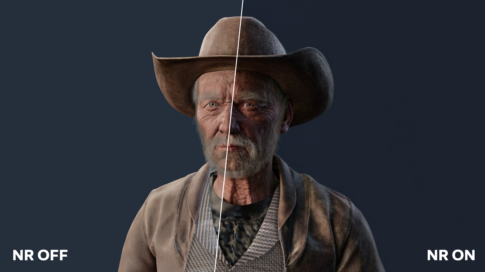

# OpenDLSS-NR

A Vulkan reimplementation of NVIDIA's DLSS 5 Neural Rendering network, bit-exact against the original.

The same 71-block Swin / ViT network as DLSS-NR build 310.8.0, running FP8 on the tensor cores. The
intermediates match too, not just the final image: all 75 block boundaries, byte for byte.

`ports/browser-webgpu/` is a second, independent implementation: the same bytes in a browser, with no
tensor cores and no FP8.

**You supply the weights**, as a model directory in the layout described below.

## The network

A U-net of shifted-window transformer blocks with a global ViT at the bottom: 71 blocks over six pooling
levels, FP8 (E4M3) activations with FP16 accumulation, 141 MiB of weights. It is a generative neural rendering
network (NVIDIA's term): it re-renders the frame the engine already drew, generating detail from injected noise
and adjusting tone, structure and skin under a style setting. Input and output are the same resolution; it is not
an upscaler.



*The WebGPU port at 2048x1152, NR off on the left and on on the right. Scene:
[Cowboy Gramps](https://www.blendkit.com/asset-gallery-detail/96dce188-9c9c-4699-a45a-48663fbbbcb7/) by
Muhammed Ismayil, CC0.*

It takes one rendered frame (a low dynamic range proxy of it, three lanes of Gaussian noise, the previous
frame's output reprojected, and five conditioning scalars) and produces four f32 channels per pixel: an RGB
residual and one temporal-blend logit. [docs/network.md](docs/network.md) is the graph in full. NVIDIA
describes the model in its report,
[DLSS 5: Generative Neural Rendering](https://research.nvidia.com/labs/adlr/DLSS5/files/DLSS5_Report.pdf)
([project page](https://research.nvidia.com/labs/adlr/DLSS5/)).

## Build and run

```
powershell -File scripts\fetch_tools.ps1 [-Npm]     # once: tools\ (glslang, Vulkan-Headers, volk, CMake, Ninja)
powershell -File scripts\build.ps1                  # shaders, PTX, build\dlss5vk.exe
powershell -File scripts\fetch_filament.ps1         # once, for the demo: third_party\filament (+ the patch)
powershell -File scripts\build_filament.ps1         # once, for the demo: third_party\filament-install
powershell -File scripts\build_demo.ps1             # build\demo\dlss5-demo.exe
```

```
build\dlss5vk.exe bench   --model <dir> --width 768 --height 768
build\dlss5vk.exe profile --model <dir> --width 768 --height 768   # per-dispatch timings
build\dlss5vk.exe parity  --model <dir> --fixture <dir>            # bit-exactness against a fixture
build\dlss5vk.exe verify  --model <dir> --fixture <dir>            # block-0 kernel-by-kernel bisect
python scripts\ptx\test_fast_divmod.py                             # the PTX divider, over every n < 2^24 (numpy)
```

The demo can be double-clicked. It lists every scene under `build\scenes` in the **Demo scene** dropdown and
starts on the first one, or loads the glTF given on the command line. The model directory is `--model <dir>`,
else `DLSS5VK_MODEL`, else `models\nr` next to this README. See [demo/README.md](demo/README.md) for the
renderer, the keys, the scenes and `view.json`.

## Performance

RTX 4070 SUPER, whole network per frame, minimum over 40 frames. 241 dispatches at every resolution.

| resolution | time |
| --- | --- |
| 768x768 | 2.8 ms |
| 1920x1080 | 7.8 ms |
| 2560x1440 | 12.6 ms |
| 3840x2160 | 29.3 ms |

The GPU alternates between two clock states under sustained load, so medians run a few percent higher. Compare
minima.

## What is here

| Part | Files | Notes |
| --- | --- | --- |
| Host | `src/` (C++20) | Vulkan context, model loading and weight re-layout, kernel wrappers, the network graph, a CPU reference of the arithmetic, the `dlss5vk` tool |
| GLSL kernels | `shaders/` | The reference route: cooperative-matrix FP8 GEMMs, fused 32-channel block, fused QKV + window attention, expert MLP, global attention, elementwise ops. Exact and complete on their own. |
| PTX kernels | `scripts/ptx/` | Python generators emitting PTX for the fast route: `mma.sync` E4M3 with f16 accumulation, cp.async rings, barrier-free chaining through device counters, split-K GEMMs, streamed global attention. Generated into `build/ptx` by the build. |
| Demo | `demo/`, `third_party/filament.patch` | The network inside a Filament (Apache-2.0) frame: Filament patched for per-object motion vectors and a Vulkan interop hook, glTF scenes through gltfio, ImGui controls. |
| WebGPU port | `ports/browser-webgpu/` | The same network in a browser, bit-exact against the same captures, with no tensor core, no FP8, no fusion between blocks and no chaining: the exactness is in the specification, not in the hardware. 72 ms at 512x512 against 2.7 ms here. |

Not implemented: DLSS-SR, which is a different network. The temporal path is implemented, but in the demo: the
network's history input lanes and its per-pixel blend logit drive a reprojected feedback loop
([docs/frame.md](docs/frame.md)). The `dlss5vk` tool runs single frames with no history, which is what the
reference captures were made with.

## Requirements

- Windows, an NVIDIA Ada (or newer) GPU and a driver exposing `VK_KHR_cooperative_matrix`,
  `VK_NV_cooperative_matrix2`, `VK_EXT_shader_float8` and `VK_NV_cuda_kernel_launch`.
- Visual Studio 2022 or later with the C++ x64 toolset (any edition or the Build Tools; found through vswhere,
  or set `VCVARS64` to your `vcvars64.bat`), git, Python 3 for the PTX generators, and Node.js + npm and
  Pillow for the scene converter.
- The portable toolchain under `tools/` (git-ignored): `scripts\fetch_tools.ps1` downloads glslang 16.6.0,
  Vulkan-Headers v1.4.363, volk (pinned tags), CMake 3.31 and Ninja 1.13. No Vulkan SDK install is needed.
  `-Npm` also installs the scene converter's modules into `tools\gltf`.
- For the demo: Filament v1.77.0, cloned and patched by `scripts\fetch_filament.ps1` and built once by
  `scripts\build_filament.ps1` (both git-ignored; about 15 minutes and 6 GB of build tree, placed in
  `%LOCALAPPDATA%\dlss5-vulkan` or `DLSS5_FILAMENT_BUILD_DIR`; `DLSS5_BUILD_JOBS` caps the parallel
  compiles, default 8, because MSVC takes up to a GB per job on Filament).

## Model directory

`nr::Model` reads `manifest.json`: a `stages` array (each entry: `id`, `file` relative to the directory,
`packedByteLength`, `sha256`) and a `tensors` array (each entry: `name`, `block`, `layer`, `parameter`,
`stage`, `stageOffset`, `byteLength`). Stage files hold the E4M3 weights as packed bytes; the host re-lays
them out into the matrix forms the kernels consume (`src/nr_model.cpp`). Nothing in this repository produces
such a directory.

The graph is the 71-block network of 310.8.0 and nothing else: a model with a different block count is refused
at load.

## Fixtures

`parity` compares against recorded captures of the original, which are not part of this repository. A fixture is a
directory with a `manifest.json`:

| key | |
| --- | --- |
| `sourceDimensions`, `fullDimensions` | the valid size and the padded field |
| `proxy` *or* `inputFeatures` | the input: an RGBA f32 image (with `conditioning`, `seed`, `autoMask`), or the f32 features themselves |
| `checks` | what the fixture gates, any of `"boundaries"`, `"head"`, `"output"`; required and never empty |
| `blocks`, `transitions` | `"boundaries"`: E4M3 references (`block` / `id`, `width`, `height`, `channels`, `file`) |
| `omittedBoundaries` | `"boundaries"`: `{name: reason}` for each comparable boundary the fixture has no reference for |
| `referenceHead` | `"head"`: the f32 RGBA head |
| `nativeOutput` | `"output"`: the composed image, `dtype` `"f32"` (RGBA halves, needs `proxy`) or `"u8"` (an 8-bit capture) |

Everything is validated before the GPU runs, and a fixture that fails any of it is refused: a declared check without
its reference, a reference that is missing, short or names nothing in the graph, a reference no declared check uses,
or a comparable boundary (blocks 0-69, the five encoder transitions) with neither a reference nor a reason. Verdicts
are **bit-exact** (the pass), **equal only up to the sign of zero** (a failure), **within one code** (the 8-bit
capture only, reported apart) or a mismatch; see [docs/numerics.md](docs/numerics.md). The head and the output are
compared on the production schedule, resubmitted `--repeat` times (default 3), which must also agree with the same
graph under barriers; the boundaries come from an instrumented run, whose head must agree with production's. `verify`
additionally needs `inputFeatures` and a `block-0` reference.

## Tuning switches

All default to the fast, exact route. Every switch keeps the output byte-identical, and `parity` under each of
them is part of the gate. Any switch that sends a kernel back to GLSL also turns counter chaining off, because
only the PTX kernels take part in it.

- `DLSS5VK_UNFUSED=1` runs the GLSL reference route, up to 2560x1440: it materializes every intermediate.
- `DLSS5VK_PTX_DIR` is the PTX directory, default `build/ptx`.
- `DLSS5VK_CHAIN=0` puts barriers between every launch instead of counter chaining.
- `DLSS5VK_PTX_GEMM`, `GEMMT`, `GEMMV`, `BLOCK32`, `FFN`, `QKV` and `ATTN` set to 0 take one kernel family
  back to its GLSL spelling.
- `DLSS5VK_ATTN_STREAM` forces streamed global attention off (0) or on (1).
- `DLSS5VK_SPLITK=0`, `DLSS5VK_VIT_CHAIN=0` and `DLSS5VK_NO_PTX_MLP=1` disable split-K, the ViT chain and the
  PTX MLP.
- `DLSS5VK_NO_FUSE_PRE`, `POOL`, `UPRES` and `POST` set to 1 drop one fusion each.
- `DLSS5VK_CHAIN_MASK` is a bit mask: 1 expert stages, 2 c32 blocks, 4 split GEMMs. Default 3.
- `DLSS5VK_DEFER_MAX` is the widest stage whose projection GEMM is fused. Default 128.
- `DLSS5VK_VALIDATION=1` runs under the Khronos validation layer (refused if it is not installed: a Vulkan SDK, or
  `VK_LAYER_PATH` at a build of Vulkan-ValidationLayers); an error it reports fails the run. `DLSS5VK_DEBUG=1`
  only prints the driver's own messages (the PTX compiler's among them). `DLSS5VK_LIST_EXTENSIONS=1` lists
  extensions.

## Documentation

[docs/README.md](docs/README.md) is the index: [network.md](docs/network.md) is the graph,
[numerics.md](docs/numerics.md) the exactness contract, [weights.md](docs/weights.md) the layouts,
[execution.md](docs/execution.md) the scheduling, and [frame.md](docs/frame.md) the demo's frame.

## Not affiliated with NVIDIA

This project is not affiliated with, endorsed by, or supported by NVIDIA. It contains no NVIDIA software,
weights, headers, or instructions for obtaining them. No rights under any NVIDIA intellectual property are
granted or implied by this repository or its license, and you are responsible for the licenses that apply to
whatever model data you use with it.

## License

MIT for everything in this repository ([LICENSE](LICENSE)). Third-party components are listed in
[NOTICE](NOTICE).
